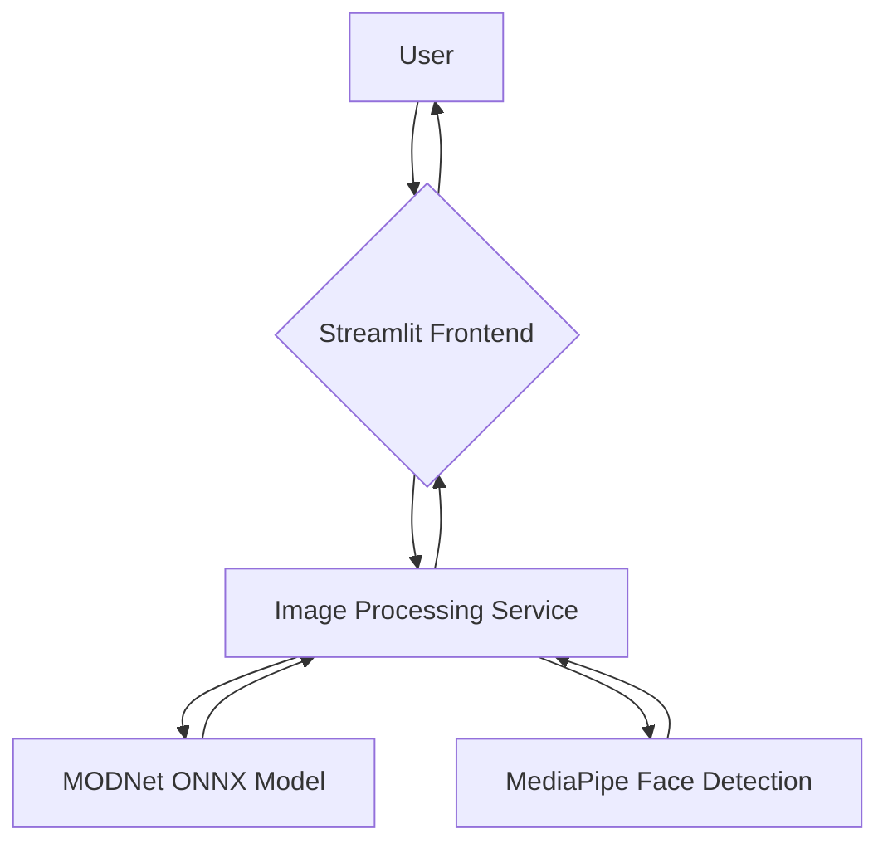
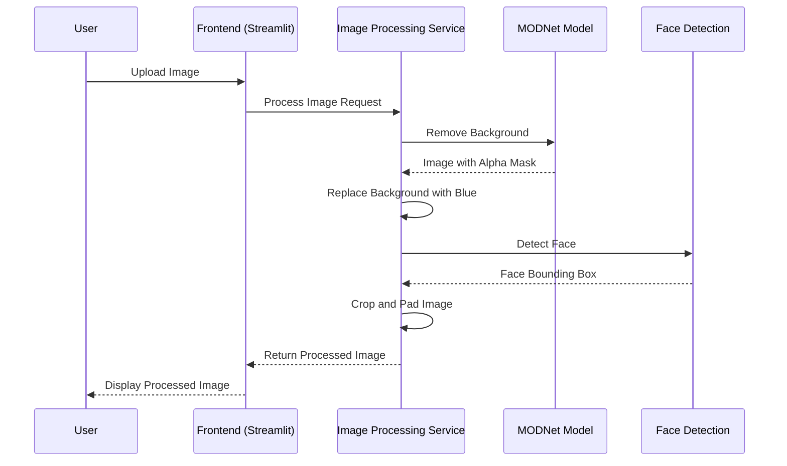

# Passport Image Creator

## Project Overview

This project is a Streamlit web application that automatically converts user-uploaded images into passport-style photos. The application streamlines the process of creating passport photos by performing background removal, face detection, and appropriate cropping and padding.

**Main Features:**

*   **Automatic Background Removal:** Utilizes the MODNet ONNX model to accurately remove the background from an input image.
*   **Face Detection:** Employs the MediaPipe Face Detection library to identify the face in the image, ensuring the final photo is correctly centered.
*   **Passport-Style Cropping:** Crops the image around the detected face with proportional padding to meet standard passport photo requirements.
*   **Background Replacement:** Adds a solid blue background, a common requirement for passport photos.
*   **Web-Based Interface:** A user-friendly interface built with Streamlit for easy image uploading and processing.

## Architecture

The application follows a simple, single-module architecture. The core components are:

*   **Streamlit Frontend (`main.py`):** The user interface for uploading images and displaying the results.
*   **Image Processing Service (`main.py`):** A set of functions that handle the image processing pipeline.
*   **MODNet ONNX Model (`modnet.onnx`):** A pre-trained model for background segmentation.
*   **MediaPipe Face Detection:** A library used for detecting faces in the processed image.

### Architecture Diagram



## Installation & Setup

Follow these steps to set up and run the project locally.

**1. Clone the Repository:**

```bash
git clone <repository-url>
cd passport-image-creator
```

**2. Install Dependencies:**

This project uses `uv` for package management. To install the dependencies, run:

```bash
uv pip install -r requirements.txt
```

*(Note: If a `requirements.txt` file does not exist, you can generate one from `pyproject.toml`.)*

**3. Environment Configuration:**

No special environment variables are needed for this project. Ensure that the `modnet.onnx` model and `blue_image.png` are in the root directory of the project.

## How to Run

To launch the application, run the following command in the project's root directory:

```bash
streamlit run main.py
```

This will start the Streamlit server and open the application in your default web browser.

## Usage Examples

1.  Launch the application using the command above.
2.  Click on the "Upload images" button to select one or more images from your local machine.
3.  Once the images are uploaded, click the "Process images" button.
4.  The application will process each image, and the final passport-style photos will be displayed on the page.
5.  The processed images will also be saved in the `output` directory.

## Extension & Contribution Guide

We welcome contributions to improve the Passport Image Creator. Here are some ways you can contribute:

*   **Adding New Features:** Enhance the application by adding features like adjustable background colors or different output sizes.
*   **Improving the UI/UX:** Make the user interface more intuitive and visually appealing.
*   **Writing Tests:** Since there are limited automated tests, adding comprehensive tests would be a great contribution.
*   **Refactoring Code:** Improve the code structure for better readability and maintainability.

To contribute, please fork the repository, create a new branch for your feature or bug fix, and submit a pull request.

## Dependencies & Requirements

The project is built with Python and relies on the following libraries:

*   **streamlit:** For the web interface.
*   **opencv-python:** For image manipulation and processing.
*   **mediapipe:** For face detection.
*   **onnxruntime:** To run the background removal model.
*   **Pillow:** For image handling.
*   **numpy:** For numerical operations.

All dependencies are listed in the `pyproject.toml` file.

## Sequence Diagram

This diagram illustrates the workflow when a user uploads an image for processing.



## Potential Improvements / Roadmap

*   **Add more background options:** Allow users to choose from a palette of common passport photo background colors.
*   **Support for different passport standards:** Implement cropping and sizing presets for different countries.
*   **Improve face detection accuracy:** Fine-tune the MediaPipe parameters or explore other face detection models.
*   **Add a live camera input:** Allow users to take a photo directly from their webcam.
*   **Containerize the application:** Provide a Dockerfile for easier deployment.
